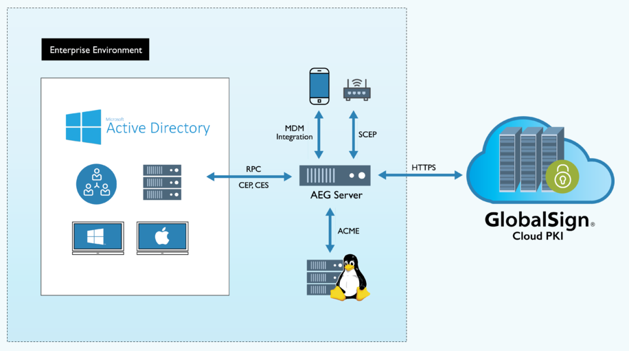
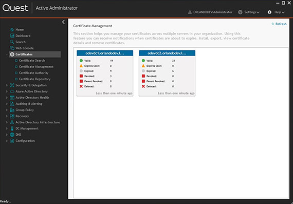
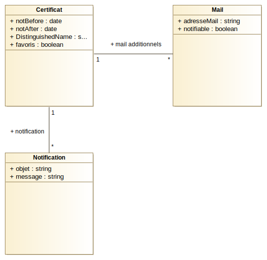
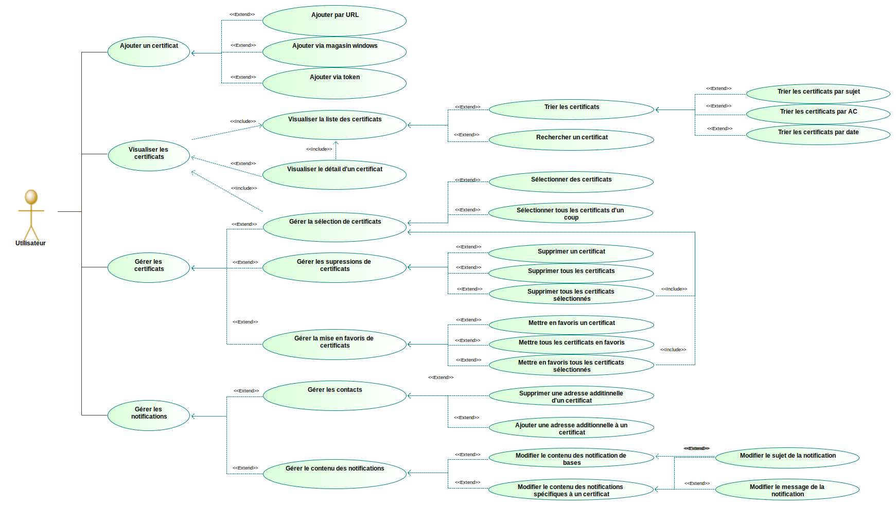
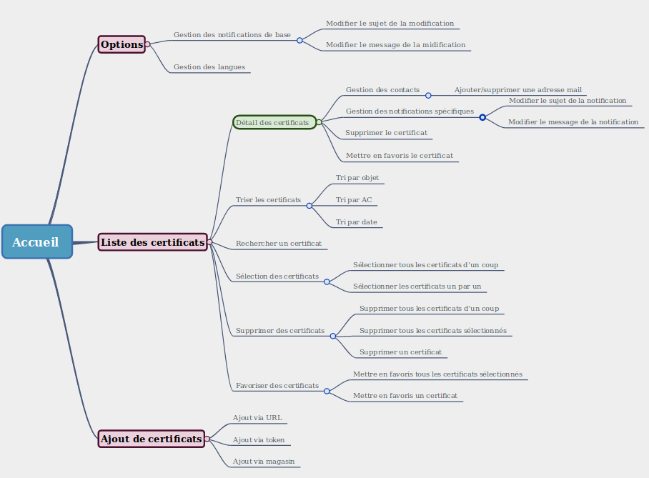
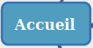

# Atteste

Application de gestion des certificats électroniques
Sujet de stage

## **Analyse de l'existant**

Très peu de logiciels ou applications permettent actuellement la gestion et la visualisation de plusieurs certificats électroniques.

Parmi les entreprises qui proposent ce type de produits :

* ### **GlobalSign :**

  L'entreprise "**GlobalSign**" vend ce service. Cette entreprise est une autorité de certification et un fournisseur de services d'identité. Parmi leurs produits on peut trouver la création de certificats SSL et la gestion de plateformes PKI. Le service qui nous intéresse est appelé "portail AEG" (Auto Enrolment Gateway). Ce portail AEG permet une automatisation et gestion simplifiée des certificats électroniques. Permettant d'avoir une vision globale des certificats fournis par GlobalSign et par d'autres sources.

  Le service proposé par GlobalSign est relativement complexe comme il propose un système de renouvellement automatique des certificats.

  Ci dessous, le schéma de l'AEG de GlobalSign :

  

  L'un des objectifs de cette plateforme est de libérer les entreprises des Autorités de Certifications (AC) Windows, jugées trop lourdes et coûteuses à entretenir.

  GlobalSign soulève un problème en 2017 :

  > Les entreprises utilisent les infrastructures à clé publique (PKI, Public Key Infrastructure) pour communiquer et échanger des données en toute sécurité. Mais, face à une véritable prolifération de terminaux divers et variés, elles s’interrogent sur la capacité des infrastructures PKI à prendre en charge ces nouveaux écosystèmes sans pour autant devenir un fardeau.

  > <cite> Communiqué de presse GLobalSign - 2017

  Le portail AEG est leur solution à ce problème.

  La solution proposée par GlobalSign est très appréciée et semble performante, mais elle reste payante et non Open Source.

* ### **Thawte :**

  L'entreprise "**Thawte**" qui vend des certificats SSL évoque dans un document la notion de "Parc de certificats", dont le but est de centraliser les certificats utilisés dans une entreprise dans un seul et même espace.

  * Le parc de certificats selon Thawte:

    Ils distinguent 5 étapes à la gestion des certificats :

    1. Effectuez un audit de tous vos domaines et certificats.

    2. Consolidez tous vos certificats au sein d’un compte géré et centralisé.

    3. Définissez un processus administratif applicable à toute l’entreprise.

    4. Programmez des alertes et produisez des rapports réguliers sur la situation du parc et les renouvellements imminents.

    5. Révoquez et remplacez les certificats en cas de besoin.

  Ainsi, l'idée principale est de regrouper tous les certificats utilisés dans un espace (ici une entreprise), de les référencer dans un compte commun à l'entreprise et enfin de mettre en place un système d'alerte afin de prévenir une fin de validité par exemple.

  Thawte vend ce service de gestion des certificats, mais il est utilisable uniquement pour les certificats SSL vendus par leur entreprise. On perd ainsi l'intérêt de rassembler tous les certificats d'une entreprise.

* ### **Quest :**

  L'entreprise "**Quest**" est une entreprise de gestion informatique qui propose diverse services comme de la gestion de base de données, de la protection des données et de la gestion de plateformes. Parmi leurs produits on trouve "Active Administrator for Certificate Management", un outil de gestion du cycle de vie des certificats numériques.

  L'application est un module d'un logiciel également vendu par Quest; "Active Administrator", qui est un logiciel de gestion des logiciels Microsoft® Active Directory® (AD) censé combler les lacunes de ces outils.

  Quest présente son application comme une "console unique" qui permet de gérer l'intégralité du cycle de vie des certificats numériques d'un milieu (principalement pour une entreprise).

  *Ci-dessous une partie de l'interface proposée par Quest.*

  

  Diverses fonctionnalités viennent avec cette application :

  * #### Détection des certificats :

    Avec la "console" de l'application, il est possible de détecter la totalité des certificats présents dans une entreprise indépendamment de l'autorité de certification du certificat.

  * #### Expiration des certificats :

    Des alertes sont envoyés à l'expiration des certificats et il est possible de générer des rapports à propos des certificats bientôt expirés afin d'avoir une vision globale de la situation.

  * #### Restauration de certificats :

    Des certificats peuvent êtres restaurés et il est possible d'effectuer des sauvegardes quotidiennes.

  * #### Déploiement de certificats :

    Il est possible de copier les certificats d'un serveur vers un autre.

  Quest nous propose ici un service extrêmement complet autorisant la gestion de plusieurs certificats. Promettant une sauvegarde de l'intégrité des données ainsi qu'un système d'alertes complet permettant de visualiser facilement la situation globale.

***

## **Synthèse :**

  La solution amenée par GlobalSign est relativement complète, l'entreprise propose une plateforme de gestion complète et ouverte à tous les certificats (même ceux achetés en dehors de GlobalSign).

  D'un autre côté, la solution amenée par Thawte est bien moins intéressante. Elle limite la capacité de gestion aux certificats proposés par leur entreprise, on a néanmoins une gestion générale assez convaincante.

  Et finalement, la solution de Quest. Celle-ci semble parfaite. Un espace de gestion dédié aux certificats avec de nombreuses fonctionnalités intéressantes, en plus de cela, la capacité de réaliser des sauvegarde est un atout de choix.

  Mais malgré cette solution assez intéressante, il n'existe aucune solution open source.

  Ainsi, la mise en place d'une application de gestion centralisée des certificats électroniques est complètement justifiée. Les applications concurrentes ne sont pas placées sur le même marché et ne font que peu d'ombre à un tel projet.

***

## **Sources :**

* *Informations sur GlobalSign :*

  https://www.globalsign.fr/fr/entreprise/actualites-et-evenements/globalsign-etoffe-sa-plateforme-de-gestion-de-certificats/

  https://www.globalsign.fr/fr/aeg-pour-active-directory/

  https://www.globalsign.fr/fr/blog/3-raisons-d-utiliser-un-service-de-gestion-de-certificats/

* *Informations sur Thawte :*

  https://www.thawte.fr/assets/documents/guides/pdf/simplify-ssl-management.pdf

  https://www.thawte.fr/ssl/enterprise-ssl-certificates/

* *Informations sur Quest :*

  https://www.quest.com/fr-fr/products/active-administrator/

  https://www.quest.com/fr-fr/products/active-administrator-for-certificate-management/

***

## Spécifications

### Diagramme de classes de la base de données

* **Les mails :**

    Chaque adresse mail possédera en plus de l'adresse un attribut "**Notifiable**" qui permettra à l'application de savoir si elle doit envoyer des notifications à cette adresse. Cet attribut est un booléen.

* **Les notifications :**

    Les notifications sont représentées par deux attributs textes, un "**objet**" qui permet d'identifier le but de la notification, et un "**message**" qui permet de préciser des détails à la notification.

* **Les certificats :**

    Les certificats sont composés de différentes données importantes. Deux dates "**Not Before**" et "**Not After**" qui permettent de connaître la période de validité du formulaire, un attribut "**Distinguished Name (DN)**" qui contient toutes les informations importantes relatives au certificat, à savoir l'autorité de certification (AC), l'adresse, le pays ou encore les informations de contacts. Un attribut "**Favoris**" permet de savoir si ce certificat doit être affiché en favoris dans la liste ou non, cet attribut est un booléen (true ou false).

    Finalement, les certificats ont une relation avec deux autres classes.

    * La première relation concerne les mails. En effet les mails concernés directement par le certificat sont stockés dans le "**Distinguished Name**" et ne sont pas modifiables par l'utilisateur. Or on souhaite pouvoir ajouter des contacts aux certificats. C'est pourquoi les certificats possèdent une relation "one to many" avec les mails, permettant aux certificats d'avoir une liste de "**mails additionnels**".

    * La seconde relation concerne les notifications. Si aucune notification n'est liée à un certificat, alors on envoi les notification de base programmées via les options de l'application, mais il est possible de préciser des notifications. C'est pourquoi on peut lier des notifications à un certificat.

***

### Récupération des certificats

Une page dédiée à l'ajout de certificats à la base de données offrira différentes manières de les ajouter.

* **Par URL :**

  * L'utilisateur a accès à un formulaire.

  * L'utilisateur peut entrer une URL dans un champ prévu à cet effet.

  * En validant le formulaire :

  * Il pourra visualiser une liste des certificats présent dans l'URL.

    * Pour chaque certificat de la liste, l'utilisateur peut décocher ou cocher une case (cochée de base) qui permettra de choisir si oui ou non on décide d'enregistrer le certificat.

    * Une vois les certificats choisis, un bouton permet de définitivement enregistrer les certificat.

    * Après avoir enregistré les certificats, on obtient un visuel des certificats enregistré ainsi que le choix de continuer à entrer des URL, ou de visualiser la liste des certificats enregistrés.

  * Si aucun certificat n'est présent ou que l'URL est incorrecte, un message d'erreur apparaît en réponse.

* **Par le magasin de certificats :**

  * L'utilisateur a accès à un bouton permettant de récupérer l'ensemble des certificats de l'ordinateur.

  * Une fois le bouton appuyé, l'utilisateur pourra visualiser une liste des certificats présent dans l'ordinateur.

    * Pour chaque certificat de la liste, l'utilisateur peut décocher ou cocher une case (cochée de base) qui permettra de choisir si oui ou non on décide d'enregistrer le certificat.

    * Une vois les certificats choisis, un bouton permet de définitivement enregistrer les certificat.

    * Après avoir enregistré les certificats, on obtient un visuel des certificats enregistré ainsi que le choix de continuer à entrer des URL, ou de visualiser la liste des certificats enregistrés.

  * Si aucun certificat n'est présent, un message d'erreur apparaît en réponse.

* **Par token :**

  * L'utilisateur à accès à un formulaire.

  * L'utilisateur peut rechercher un fichier grâce à un champ prévu à cet effet.

  * L'utilisateur peut ainsi importer son certificat.

  * Une fois le certificat choisit, l'utilisateur peut valider le formulaire.

  * En validant me formulaire :

    * Soit le formulaire est valide et le certificat est enregistré.

      * Le certificat est importé dans la liste et l'utilisateur a un visuel du certificat effectivement enregistré.

    * Dans le cas ou le certificat est invalide, une erreur est renvoyée.

***

### Gestion des certificats

#### Liste des certificats

* ***Informations visibles pour chaque certificat de la liste :***

  1. **Sujet du certificat.**

  2. **Autorité de certification.**

  3. **Date d'expiration / temps restant du certificat.**

  4. **Couleur**

      a. Une couleur est présente pour chaque certificat de la liste.

      b. Elle représente l'état du certificat dans le temps.

      c. Vert / Orange / Rouge en fonction du temps.

* ***Actions possible sur la liste :***

  1. **Bouton / icône "supprimer" :**

      a. Pour chaque certificat de la liste, un bouton "supprimer" est présent.

      b. Il permet de supprimer un certificat de la base de données.

      c. Une fois ce bouton activé, on demande à l'utilisateur s'il veut vraiment supprimer ce certificat.

      d. S'il décide de le supprimer, le certificat est supprimé de la base de données.

      e. Sinon rien ne se passe.

  2. **Bouton / icône "supprimer tout" :**

      a. Un bouton "supprimer tout" est présent dans la liste.

      b. Il permet de supprimer tous les certificats de la base de données.

      c. Une fois ce bouton activé, on demande à l'utilisateur s'il veut vraiment supprimer tous les certificats.

      d. S'il décide de les supprimer, les certificat sont supprimés de la base de données.

      e. Sinon rien ne se passe.

  3. **Bouton/ icône "Ajouter aux favoris :"**

      a. Pour chaque certificat dans la liste, un bouton "ajouter aux favoris" est présent.

      b. Cliquer dessus ajoute / retire le certificat des favoris.

      c. Un certificat ajouté aux favoris sera en haut de la liste.

      d. Pour chaque ajout / retrait d'un favoris, on envoi une notification à l'utilisateur. Cette notification prévient d'un ajout ou d'un retrait des favoris.

  4. **Sélection des certificats :**

      a. Pour chaque certificat de la liste, une case à cocher est présente.

      b. Il est possible de cocher / décocher ces cases afin de sélectionner les certificats et effectuer des actions de groupes décrites plus tard.

  5. **Bouton sélectionner tout :"**

      a. Un bouton "tout sélectionner" est présent en haut de la liste.

      b. en appuyant sur ce bouton, on sélectionne / dé-sélectionne tous les certificats de la liste.

  6. **Action de groupe : supprimer :**

      a. Un bouton "Supprimer les éléments sélectionnés" est présent en haut de la liste.

      b. En appuyant sur ce bouton :

      c. Si des certificats sont sélectionnés :

          a. On demande une validation à l'utilisateur.

          b. si l'utilisateur valide les certificats sélectionnés sont supprimés.

          c. Sinon rien ne se passe.

      d. Si aucun certificat n'est sélectionné :

          a. On envoi un message disant qu'aucun certificat n'est sélectionné.

  7. **Action de groupe : Ajouter aux favoris :**

      a. Un bouton "ajouter les éléments sélectionnés aux favoris" est présent en haut de la liste.

      b. En appuyant sur ce bouton :

      c. Si des certificats sont sélectionnés :

          a. Les certificats sélectionnés sont ajoutés aux favoris.

      d. Si aucun certificat n'est sélectionné :

          a. On envoi un message disant qu'aucun certificat n'est sélectionné.

    8. **Tri des certificats :**

        a. En cliquant sur le haut des colonnes de chaque attribut des certificats, il est possible de les trier en fonction de ces attributs.

            a. Tri par sujet.

            b. Tri par AC.

            c. tri par date.

    9. **Recherche des certificats :**

        a. Une barre de recherche est située en haut de la liste.

        b. Il est possible d'entrer des recherches et d'afficher uniquement les certificats concernés.

***

#### Détail d'un certificat

Le détail d'un certificat est accessible en cliquant sur celui-ci dans la liste.

* ***Informations visibles dans le détail d'un certificat :***

    1. Not before, date de mise en validation du certificat.

    2. Not After, date de fin de validité du certificat.

    3. adresse mail du certificat.

    4. Adresse additionnelles (contacts ajoutés par l'utilisateur).

    5. Temps restant avant fin de validité.

    6. DN (Distinguished Name) :

        a. Intitulé (Common Name).

        b. Organisation.

        c. Unité d'Organisation (Organizational Unit).

        d. Localité.

        e. Pays.

        f. Titre.

        g. Domain Component.

        h. Rue.

        i. Code postal / Zip code.

* ***Actions possibles dans le détail d'un certificat :***

    1. **Ajout de mails :**

        a. Un formulaire est présent dans le détail du certificat.

        b. Le formulaire est composé d'un champ permettant d'entrer une adresse mail et d'un bouton permettant de valider le formulaire.

        c. En validant le formulaire :

        d. Si une adresse mail valide est présente dans le champ :

            a. L'adresse mail est ajoutée aux adresses additionnelles du certificat.

        d. Si une adresse mail invalide est présente dans le champ :

            a. On envoi un message d'erreur à l'utilisateur.

        e. Si aucune adresse n'est présente dans le champ :

            a. On envoi un message d'erreur à l'utilisateur.

    2. **Suppression de mails :**

        a. Pour chaque adresse additionnelle présente dans le détail du certificat, un bouton "Supprimer l'adresse" est disponible.

        b. Une fois activé, ce bouton supprime l'adresse du certificat.

    2. **Bouton "Supprimer" :**

        a. Un bouton "supprimer le certificat" est présent dans le détail du certificat.

        b. Il permet de supprimer le certificat de la base de données.

        c. Une fois ce bouton activé, on demande à l'utilisateur s'il veut vraiment supprimer ce certificat.

        d. S'il décide de le supprimer, le certificat est supprimé de la base de données et l'utilisateur quitte le détail.

        e. Sinon rien ne se passe.

    3. **Bouton "Ajouter aux favoris" :**

        a. Un bouton "ajouter aux favoris" est présent dans le détail du certificat.

        b. Cliquer dessus ajoute / retire le certificat des favoris.

    4. **Gestion des notifications :**

        1. Gestion des adresses à notifier :

            a. Pour chaque adresse additionnelle, une case à cocher est présente.

            b. Si la case est cochée, le mailing automatique est activé pour cette adresse du certificat.

            c. Si la case est décochée, le mailing automatique est désactivé pour cette adresse du certificat.

        2. Gestion de l'activation des notification personnalisées :

            a. Une case à cocher permet d'activer ou de désactiver (désactivé de base) les notifications personnalisées à ce certificat.

            b. En cas d'activation des notifications personnalisées, un formulaire permettant de modifier ces notifications apparaît dans le détail du certificat (point numéro 5).

    5. **Gestion du contenu de la notification :**

        a. Dans le détail du certificat, un formulaire permettra de modifier l'objet et le message de la notification de ce certificat.

        b. En validant le formulaire, une notification personnalisée à ce certificat est créée.

        c. Il est possible de modifier tous les types de notifications.

***

#### Notifications et mailing automatique

Les notifications décrites plus bas seront à la fois visibles dans l'application et envoyée aux adresses mails présentes dans les certificats.

Un certificat peut avoir une notification personnalisée qui est modifiable dans le détail des certificats. Mais dans le cas ou cette notification est désactivée, c'est la notification de base qui est envoyée.

Si les notifications personnalisées sont modifiables dans le détail des certificats, les notifications de base sont modifiables dans les options de l'application.

* ***Informations présentes dans une notification :***

    1. Objet :

        L'objet d'une notification comporte une indication sur le but de celle-ci. Par exemple lorsque qu'un certificat arrive à son terme, l'objet de la notification pourrait être : "Certificat bientôt périmé".

    2. Certificat concerné :

        Des informations sur le certificat concerné par la notification seront communiquées avec la notification.

    3. Message :

        Un message permettra de compléter la notification en donnant des spécifications sur celle-ci.

* ***Déclenchement d'une notification :***

    1. Différents stages sont identifiables dans le temps pour les certificats. On souhaite donc déclencher des notifications lorsque un certificats entre dans l'un de ces stades. Par exemple lorsque le certificat va expirer dans un ans, un mois ou une semaine.

* ***Gestion des notifications:***

    1. **Modification du sujet :**

        Afin d'altérer le sujet de la notification, un champ est présent dans le formulaire de modification et permet d'entrer un nouveau sujet.

    2. **Modification du message :**

        Afin d'altérer le message de la notification, un champ est présent dans le formulaire de modification et permet d'entrer un nouveau message.

***

#### Diagramme de cas d'utilisation de l'application

* Les cas d'utilisation principaux sont au nombre de quatre. On y trouve :

  * **L'ajout de certificats.**

  * **La visualisation des certificats.**

  * **La gestion des certificats.**

  * **La gestion des notifications.**

***

#### Organisation du frontend

* ***Légende :***

  * 

    Représente la page d'accueil du site.

  * 

    Représente une page du site.

  * 

    Représente un pop up / une zone importante du site.

  * 

    Représente une action ou une section du site.
